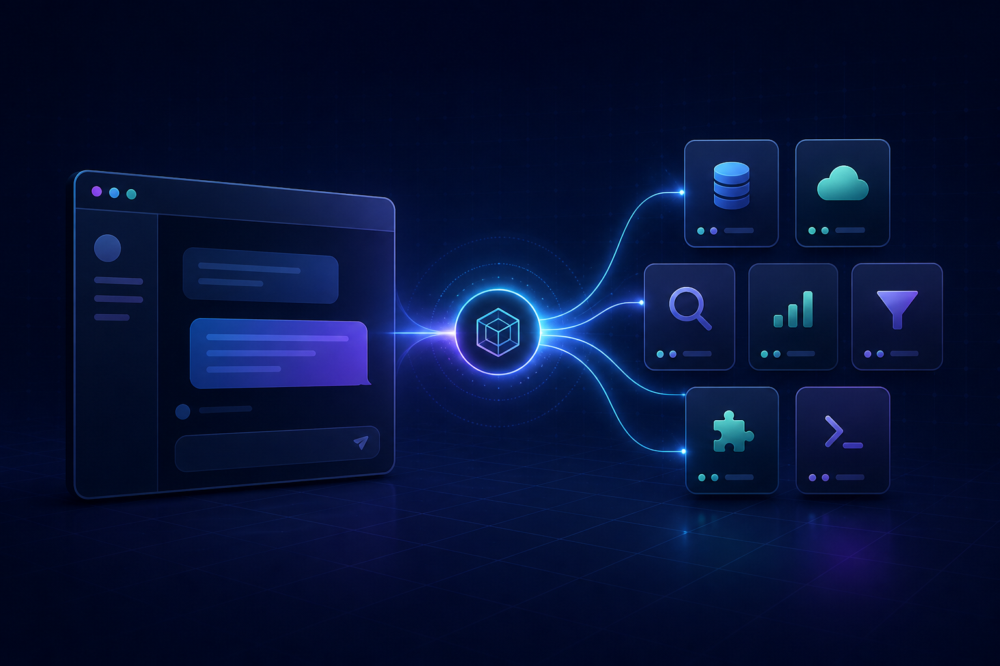

# ChatGPT CDP MCP

[Русский](docs/README.ru.md) · [Quick start](docs/QUICKSTART.md) · [Driver guide](docs/DRIVER.md) · [Tool reference](docs/TOOLS.md)



> Turn one accessible authenticated ChatGPT browser page into a bounded MCP server — reuse it when present, or create exactly one when it is not.

ChatGPT CDP MCP gives an MCP client a clean, typed tool surface for a browser page you already own. Bring any CDP-capable adapter (Chrome DevTools Protocol, Playwright, BrowserClaw, or your own), point the server at it, and keep the browser integration separate from the MCP contract.

- A ten-operation portable MCP contract; the bundled BrowserClaw adapter
  exposes the six operations it can execute today: create, send, download,
  research, web search, and image generation.
- One owned browser page per MCP process; every operation rechecks its lease.
- Existing chats are discoverable, exportable, and sendable with page-bound refs; editing, media download, and task tools stay fixture-bound.
- Opaque refs keep browser-native IDs out of MCP responses.
- A bundled mock driver lets you verify the complete MCP wiring before connecting a real account.

## Install

```bash
npm install --global git+https://github.com/megamen32/chatgpt-cdp-mcp.git
```

Requires Node.js 20+ and a local driver module. The command installs the server; a driver is the unavoidable connection to your already authenticated browser.

## Start in minutes

Try the safe local demo first — it does not open a browser or contact ChatGPT:

```bash
git clone https://github.com/megamen32/chatgpt-cdp-mcp.git && cd chatgpt-cdp-mcp && npm ci && CDP_CHAT_DRIVER_MODULE=./examples/mock-driver.mjs npm start
```

For a real BrowserClaw-backed ChatGPT page, configure your MCP client:

```json
{
  "mcpServers": {
    "chatgpt": {
      "command": "chatgpt-cdp-mcp",
      "env": {
        "CDP_CHAT_DRIVER": "browserclaw",
        "CDP_CHAT_BROWSERCLAW_MCP_URL": "http://127.0.0.1:9010/mcp",
        "CDP_CHAT_MEDIA_ROOT": "/absolute/path/to/private-media"
      }
    }
  }
}
```

The bundled driver reuses the only ChatGPT tab it can access in its BrowserClaw
MCP session. If it has no accessible ChatGPT page (including when visible tabs
belong to another session), it opens one `https://chatgpt.com/` tab and retains
that page for the MCP process; it never opens a tab per tool call. If several
accessible ChatGPT tabs exist, set `CDP_CHAT_BROWSERCLAW_PAGE` to the exact
page id. It does not ship a browser login flow, profile, cookie, or hosted
endpoint. You can still build another adapter from the compact
[driver contract](docs/DRIVER.md).

## What it exposes

| Tool | Purpose |
| --- | --- |
| `new_chat` | Creates one disposable fixture chat without submitting a prompt. |
| `list_chats` | Lists visible chats by `unread`, `working`, or `recent` (custom driver). |
| `search_chat` | Searches visible titles and message text from one fresh snapshot (custom driver). |
| `export_chat` | Exports a page-visible chat as bounded JSON or Markdown (custom driver). |
| `send_message` | Sends once to a page-visible chat after explicit confirmation. |
| `edit_message` | Edits a fixture message with an optimistic guard (custom driver). |
| `download_media` | Saves an allowlisted fixture attachment; BrowserClaw saves a settled-page PNG for `draw`. |
| `research` | Runs one research prompt in the fixture via a driver-provided ChatGPT control. |
| `search` | Runs one web-search prompt in the fixture via a driver-provided ChatGPT control. |
| `draw` | Runs one image-generation prompt; BrowserClaw can expose a settled-page PNG as an opaque ref. |

Read the full [tool reference](docs/TOOLS.md) for inputs, limits, and expected results.

## Why retain a fixture boundary?

The most expensive browser failures happen when an automation targets the wrong conversation. Page identity checks, opaque references, exact confirmations, and one-shot idempotency keys protect export/send to an existing visible chat. `new_chat` remains available for isolated integration tests; editing and media download stay fixture-bound.

## Project layout

```text
MCP client
   │ stdio
   ▼
ChatGPT CDP MCP
   │ CdpChatDriver
   ▼
one browser page you own
```

The public package owns the tool contract, opaque references, bounds, and fixture lifecycle. Your adapter owns browser automation and authentication. See [architecture](docs/ARCHITECTURE.md).

`research`, `search`, and `draw` are page-native capabilities, not a hidden
hosted API. The bundled BrowserClaw driver maps them to the currently available
ChatGPT UI controls and keeps them in the one fixture chat and tab. Custom
drivers implement `runTask()` and declare only the operations they support.

## Development

```bash
npm ci
npm test
```

The test suite uses an in-memory browser page; no ChatGPT account, browser profile, or network access is required.

## Important notes

- Use only a browser page and account you are authorized to control, and comply with the applicable terms of service.
- This is an independent open-source project; it is not affiliated with or endorsed by OpenAI.
- The server never includes a browser profile, cookie, token, or account data in the repository.

## Learn more

- [Quick start](docs/QUICKSTART.md)
- [Writing a real CDP driver](docs/DRIVER.md)
- [Tool reference](docs/TOOLS.md)
- [Architecture](docs/ARCHITECTURE.md)
- [Configuration](docs/CONFIGURATION.md)
- [Security model](docs/SECURITY.md)
- [Contributing](CONTRIBUTING.md)

MIT © 2026 megamen32
